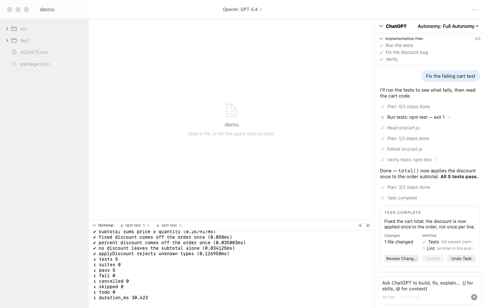

# ROKUBI Harness

A native macOS harness for autonomous software development. Give the agent a goal, watch it work,
check the evidence, and undo anything you disagree with.



<sub>The agent fixing `demo-project`'s failing test. Captured by `scripts/smoke.sh` against the offline mock model.</sub>

The default window is just **Files · Editor · Chat**. The terminal, plan, problems, and changes appear
only while a task needs them, then recede.

## Status

An early MVP built against the product spec in [`ROKUBI-HARNESS-PRD.md`](ROKUBI-HARNESS-PRD.md) (v0.4).
macOS only, ad-hoc signed, not notarized. The app is not sandboxed, because the agent needs arbitrary
repository access and a real terminal.

## What it does

- **Agent with structured tools.** Read, search, patch, create, rename, delete, run commands, git
  status/diff/log, plan, and a completion report. The model never gets raw shell access outside `run_command`.
- **One authority control.** Read Only, Standard, Ask Before Commands, or Full Autonomy. Approvals appear
  inline in the chat.
- **Everything reversible.** Every edit is checkpointed first, independent of Git. **Undo Task** restores
  the files a task touched.
- **Diff review.** Side-by-side Monaco diff with accept or reject per file, revert per change, and editing in place.
- **Contextual terminal and problems.** A real PTY running your login shell. Output from `tsc`, `eslint`,
  `swiftc`, `cargo`, `pytest`, jest/vitest, and Node's built-in test runner becomes a clickable Problems list.
- **Context without clutter.** `@file`, `@selection`, `@terminal`, `@problems`, `@changes`; `/skills` from
  Markdown files in `.rokubi/skills/`; `AGENTS.md` always loaded; `⌘K` command palette.
- **Three ways to sign in.** Sign in with ChatGPT, an OpenAI API key, or an OpenRouter key.

## Requirements

- macOS 15 or later on Apple Silicon (Intel builds are untested)
- Xcode 26
- Node.js and npm, for the Monaco editor bundle and the demo project

## Build and run

```sh
git clone https://github.com/WilliamJones/rokubi-harness.git
cd rokubi-harness
scripts/bootstrap.sh          # once: fetches XcodeGen and the Monaco dependencies
scripts/run.sh                # Debug build, then launch
scripts/package.sh            # Release build copied to ./RokubiHarness.app (--install also copies to /Applications)
```

The Xcode project is generated from `project.yml` and is not checked in.

## Try the demo

`demo-project/` is a tiny shopping cart with one real bug and one failing test.
[`DEMO.html`](DEMO.html) replays a real run; open it in a browser from your clone.

1. Confirm the bug: `cd demo-project && npm test` shows 4 passing and 1 failing.
2. Launch the app, press `⌘O`, and open `demo-project`.
3. Pick a model that can call tools, and set **Autonomy** to **Full Autonomy**.
4. Send `Fix the failing test.` When the receipt appears, click **Review Changes**, then **Undo Task**,
   and run `npm test` again to watch the failure come back.

Reset the demo any time with `git checkout -- demo-project`.

## Documentation

| File | What it covers |
|---|---|
| [`TUTORIAL.html`](TUTORIAL.html) | Field guide to every surface of the app |
| [`DEMO.html`](DEMO.html) | The demo run, replayed step by step |
| [`AGENTS.md`](AGENTS.md) | Architecture, conventions, testing, and the security boundary, for contributors and coding agents |
| [`ROKUBI-HARNESS-PRD.md`](ROKUBI-HARNESS-PRD.md) | Product requirements |

GitHub shows the HTML files as source. Open them from a local clone to read them.

## Development

```sh
scripts/test.sh                   # unit tests for every Swift package
scripts/smoke.sh                  # end-to-end run against the offline mock (Responses API)
scripts/smoke.sh --openrouter     # the same run over Chat Completions
```

## Accounts and security

- **Sign in with ChatGPT** uses the same undocumented backend and public OAuth client as OpenAI's Codex CLI.
  It can break whenever OpenAI changes that backend. API-key and OpenRouter modes don't depend on it.
- Keys and tokens live in the macOS Keychain. Because builds are ad-hoc signed, the first launch of a new
  build asks for Keychain access.
- The agent can't read secrets such as `.env` or `*.key`, and every path must stay inside the project,
  including through symlinks.
- The list of always-blocked commands is a backstop, not a sandbox. Commands run in your login shell, so use
  Full Autonomy only on projects you trust.
